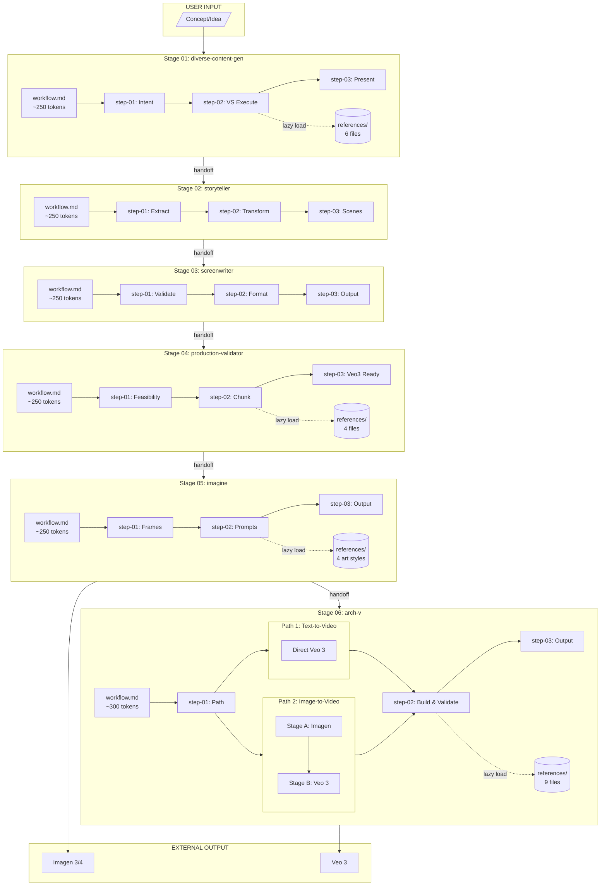

# Creative Studio Architecture

Technical documentation for the Creative Studio context engineering architecture.

---

## Architecture Overview

Creative Studio implements a **micro-file architecture** with **lazy loading** to minimize token consumption while maintaining full functionality.

```
┌─────────────────────────────────────────────────────────────────────────────┐
│                    CREATIVE STUDIO ARCHITECTURE                             │
├─────────────────────────────────────────────────────────────────────────────┤
│                                                                             │
│   MODULE LAYER                                                              │
│   ┌─────────────────────────────────────────────────────────────────────┐  │
│   │  module.yaml                                                         │  │
│   │  • Pipeline stage definitions                                        │  │
│   │  • Dependency declarations                                           │  │
│   │  • State file paths                                                  │  │
│   └─────────────────────────────────────────────────────────────────────┘  │
│                                    │                                        │
│                                    ▼                                        │
│   WORKFLOW LAYER                                                            │
│   ┌─────────────────────────────────────────────────────────────────────┐  │
│   │  workflow.md (per stage)                                             │  │
│   │  • Configuration loading (~50 tokens)                                │  │
│   │  • Path definitions (~50 tokens)                                     │  │
│   │  • Step routing logic (~100 tokens)                                  │  │
│   │  • Core concepts summary (~50 tokens)                                │  │
│   │  TOTAL: ~250 tokens per workflow                                     │  │
│   └─────────────────────────────────────────────────────────────────────┘  │
│                                    │                                        │
│                                    ▼                                        │
│   STEP LAYER (Sequential Loading)                                          │
│   ┌─────────────────────────────────────────────────────────────────────┐  │
│   │  step-01-*.md → step-02-*.md → step-03-*.md                         │  │
│   │  • Each step: 250-400 tokens                                         │  │
│   │  • Loaded only when reached                                          │  │
│   │  • Contains execution logic                                          │  │
│   └─────────────────────────────────────────────────────────────────────┘  │
│                                    │                                        │
│                                    ▼                                        │
│   REFERENCE LAYER (Conditional Loading)                                    │
│   ┌─────────────────────────────────────────────────────────────────────┐  │
│   │  references/*.md                                                     │  │
│   │  • Core references: 500-1000 tokens each                            │  │
│   │  • Extended examples: 2000-5000 tokens each                         │  │
│   │  • Loaded ONLY when specific feature needed                         │  │
│   └─────────────────────────────────────────────────────────────────────┘  │
│                                                                             │
└─────────────────────────────────────────────────────────────────────────────┘
```

---

## Context Engineering Principles

### 1. Lazy Loading

**Never pre-load resources.** Each file is loaded only when needed.

```
WRONG:
┌──────────────────────────────────────┐
│ workflow.md                          │
│ ├── [EMBEDDED] all references        │  ← 5000+ tokens wasted
│ ├── [EMBEDDED] all examples          │
│ └── [EMBEDDED] all steps             │
└──────────────────────────────────────┘

CORRECT:
┌──────────────────────────────────────┐
│ workflow.md                          │
│ ├── READ reference X when needed     │  ← 250 tokens initially
│ ├── LOAD step-01 first               │
│ └── LOAD step-02 after step-01       │
└──────────────────────────────────────┘
```

### 2. Path-Based Loading

For workflows with multiple execution paths (like arch-v), load references based on user choice:

```yaml
# arch-v path-based loading
Path 1 (Text-to-Video):
  load:
    - short-prompt-guide.md OR long-prompt-guide.md
    - great-prompt-anatomy.md
    - camera-movements.md (if movement specified)

Path 2 (Image-to-Video):
  Stage A:
    load:
      - great-prompt-anatomy.md (visual components only)
  Stage B:
    load:
      - camera-movements.md
      - short-prompt-guide.md OR long-prompt-guide.md
```

### 3. Reference Separation

Split large references into:
- **Core file**: Essential information (~500 tokens)
- **Extended file**: Examples and edge cases (~2000+ tokens)

```
references/
├── camera-movements.md       # Core: 50 common movements
├── movement-catalog.md       # Extended: 100+ movements with details
├── short-prompt-guide.md     # Core: template and rules
└── short-prompt-examples.md  # Extended: 50+ examples
```

### 4. Minimal Workflow.md

The workflow.md file should contain ONLY:
- Configuration loading instructions
- Path definitions
- Step routing logic
- Brief concept summary

**Target: ~250 tokens**

---

## Handoff Schema Architecture

### Stage-to-Stage Contract

Each stage communicates with the next via standardized handoff metadata:

```yaml
# handoff-schema.yaml structure

stage_01_to_02:
  required_fields:
    - content_file: path to generated content
    - emotional_core: extracted emotional theme
    - tone: narrative tone
    - narrative_structure: story arc type
  optional_fields:
    - variations_count: number of VS variations
    - selected_variation: which was chosen

stage_02_to_03:
  required_fields:
    - scenes_file: path to scene breakdown
    - scene_count: number of scenes
    - visual_style: overall aesthetic
    - emotional_beats: per-scene emotions

stage_03_to_04:
  required_fields:
    - screenplay_file: path to formatted screenplay
    - scene_count: number of scenes
    - estimated_runtime: in seconds
    - has_dialogue: boolean

stage_04_to_05:
  required_fields:
    - validated_screenplay: path to validated version
    - chunks: array of 8-second segments
    - key_frames: recommended frames for images
    - validation_status: passed/warnings/failed

stage_05_to_06:
  required_fields:
    - prompts_file: path to Imagen prompts
    - art_style: applied style
    - total_prompts: count
    - pipeline_completed: boolean for imagine stage
```

### State File Architecture

```
_state/
├── creative-pipeline-state.yaml    # Global pipeline state
│   ├── current_stage: 3
│   ├── stages_completed: [1, 2]
│   ├── stage_01: { tracking_file, output_file, timestamp }
│   ├── stage_02: { tracking_file, output_file, timestamp }
│   └── ...
│
├── handoff-schema.yaml             # Contract definitions
│
└── [workflow]-[timestamp].yaml     # Per-execution tracking
    ├── stage: 01
    ├── workflow: diverse-content-gen
    ├── timestamp: ISO
    ├── status: completed
    ├── output_files: [...]
    └── handoff_metadata: {...}
```

---

## Token Budget Analysis

### Per-Stage Breakdown

| Stage | workflow.md | step-01 | step-02 | step-03 | Core Refs | Extended Refs |
|-------|-------------|---------|---------|---------|-----------|---------------|
| diverse-content-gen | 250 | 250 | 400 | 300 | 1,500 | 3,000 |
| storyteller | 250 | 200 | 250 | 200 | 400 | 800 |
| screenwriter | 250 | 200 | 300 | 200 | 300 | 600 |
| production-validator | 250 | 300 | 350 | 250 | 1,200 | 2,500 |
| imagine | 250 | 200 | 350 | 200 | 800 | 2,000 |
| arch-v | 300 | 250 | 400 | 300 | 2,000 | 5,000 |

### Loading Scenarios

**Scenario A: Quick Short Prompt (arch-v Path 1 Short)**
```
workflow.md:     300
step-01:         250
step-02:         400
short-guide:     500
anatomy:         600
─────────────────────
TOTAL:         2,050 tokens
```

**Scenario B: Full Long Prompt with Examples (arch-v Path 1 Long)**
```
workflow.md:     300
step-01:         250
step-02:         400
step-03:         300
long-guide:      800
anatomy:         600
anatomy-examples: 2,000
camera-movements: 500
movement-catalog: 2,000
production-template: 1,000
─────────────────────
TOTAL:         8,150 tokens
```

**Scenario C: Full Pipeline End-to-End**
```
Stage 01-05:   ~5,000 tokens (sequential, not accumulated)
Stage 06:      ~3,000 tokens (path-dependent)
─────────────────────
MAX ACTIVE:    ~3,500 tokens at any time
```

---

## File Naming Conventions

### Workflow Files
```
workflow.md                 # Main router
```

### Step Files
```
step-01-[action].md         # First step
step-02-[action].md         # Second step
step-03-[action].md         # Third step
```

### Reference Files
```
[topic].md                  # Core reference
[topic]-[detail].md         # Extended reference
```

Examples:
```
camera-movements.md         # Core: common movements
movement-catalog.md         # Extended: full catalog

great-prompt-anatomy.md     # Core: 8 components
anatomy-examples.md         # Extended: genre examples

short-prompt-guide.md       # Core: template
short-prompt-examples.md    # Extended: 50+ examples
```

### Output Files
```
[workflow]-[timestamp].md   # Content output
[workflow]-[timestamp].yaml # Tracking output
```

---

## Integration Points

### BMAD Core Integration

```yaml
# module.yaml integration
module_id: creative-studio
bmad_core_version: ">=6.0.0"

# Uses BMAD patterns:
# - Config loading from .bmad/core/config.yaml
# - Agent manifest for party mode
# - Workflow execution framework
# - State management conventions
```

### External Tool Integration

```
┌─────────────────────────────────────────────────────────────────┐
│                    EXTERNAL INTEGRATION                         │
├─────────────────────────────────────────────────────────────────┤
│                                                                 │
│  Stage 05 (imagine) ──────────────► Imagen 3/4 API             │
│                                     • 480 token prompts         │
│                                     • Natural language          │
│                                                                 │
│  Stage 06 (arch-v) ───────────────► Veo 3 API                  │
│                                     • Text-to-video             │
│                                     • Image-to-video            │
│                                     • 8-second chunks           │
│                                                                 │
└─────────────────────────────────────────────────────────────────┘
```

---

## Error Handling

### Validation States

```
PASSED      → Continue to output generation
LOCKED      → Show conflicts, request resolution
WARNING     → Show advisory, allow continue with confirmation
```

### Common Validation Errors

| Error | Stage | Resolution |
|-------|-------|------------|
| Missing component | arch-v | Prompt for specific component |
| Camera conflict | arch-v | Reduce to one movement per beat |
| Time/weather conflict | arch-v | Make lighting consistent with time |
| Token overflow | imagine | Reduce description length |
| Chunk too long | validator | Split into multiple 8-second chunks |

---

## Performance Optimization

### Caching Strategy

```yaml
# Potential caching points (not yet implemented)
cacheable:
  - art_style_lookups: per-session
  - camera_vocabulary: per-session
  - validated_patterns: per-project

not_cacheable:
  - user_content: unique each time
  - pipeline_state: must be fresh
  - validation_results: content-dependent
```

### Parallel Execution

```
# Stages that could run in parallel (future optimization)
parallel_candidates:
  - stage_05 + stage_06 (if using Path 1)

sequential_required:
  - stages 01-04 (dependency chain)
  - stage_05 → stage_06 (if using Path 2)
```

---

## Mermaid Pipeline Diagram



---

## Future Enhancements

### Planned
- [ ] CLI shortcuts for common operations
- [ ] Caching for repeated lookups
- [ ] Parallel stage execution where possible
- [ ] Real-time validation preview

### Potential
- [ ] Integration with video editing tools
- [ ] Batch processing mode
- [ ] Template library for common video types
- [ ] A/B testing for prompt variations
